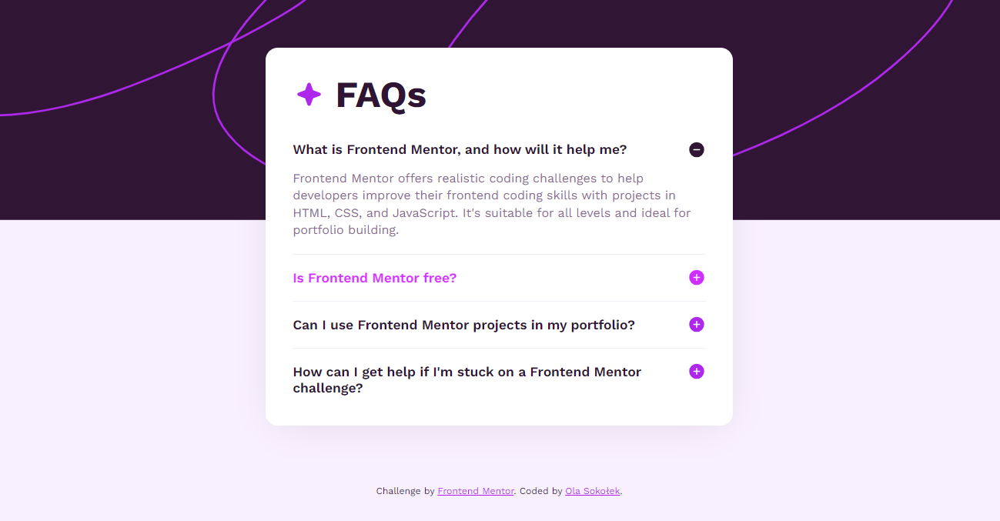

# Frontend Mentor - FAQ accordion | Solution

This is a solution to the [FAQ accordion challenge on Frontend Mentor](https://www.frontendmentor.io/challenges/faq-accordion-wyfFdeBwBz). The challenge is to build out this FAQs accordion component and get it looking as close to the design as possible. 

### What is Frontend Mentor?
[Frontend Mentor](https://www.frontendmentor.io/) challenges help me improve my skills in coding frontend solutions by building realistic projects. 

## Table of contents

- [Frontend Mentor - FAQ accordion | Solution](#frontend-mentor---faq-accordion--solution)
  - [Overview](#overview)
    - [The challenge](#the-challenge)
    - [Screenshot](#screenshot)
    - [Built with](#built-with)
    - [Links](#links)
  - [My process](#my-process)

    - [What I learned](#what-i-learned)
      - [Static fonts \& @font-face declaration](#static-fonts--font-face-declaration)
      - [Centering element horizontally](#centering-element-horizontally)
    - [Useful resources](#useful-resources)
  - [Author](#author)


## Overview

### The challenge

Users should be able to:

- Hide/Show the answer to a question when the question is clicked
- Navigate the questions and hide/show answers using keyboard navigation alone
- View the optimal layout for the interface depending on their device's screen size
- See hover and focus states for all interactive elements on the page

### Screenshot




### Built with

- Semantic HTML5 markup
- Pure CSS
- JavaScript
- Vercel (hosting & deployment)

- Git VCS

### 🟢 LIVE  Preview
- [link to be added...]()

### Links

- Solution URL: [github.com/ola-sk/CSS-practice](https://github.com/ola-sk/CSS-practice/tree/main/faq-accordion)
- [To be added: Solution's page on Frontend Mentor]()

## My process

First thing I did when starting the project is to **create a semantic HTML structure**. In this case I need a container which will be centered within the body, but I also want to add a contribution at the bottom of the page. Trying to set min-height on the body directly does not work, therefore I will place the FAQ card within a flex container within which I will be able to center it vertically & place it above the contribution taking flexible amount of vertical space. This is necessary also because the card itself needs to have size constrained to only accomodate content and not to stretch vertically if there is more vertical space available, but be centered within that space: for that it needs to be centered within another container. I then divide the FAQ card into sections with questions and answers, each of which contain similar content: header and paragraph. 

I **link the CSS stylesheet** from the HTML document. 
I **reset the basic styles** for a uniform look across browsers: I zero the margins and set box-sizing to `border-box`. 
I **define and set the font**. This time I decided to learn how to link the font present in local assets as it was available there in the starter project.
I **set colors and font-sizes**, then **adjust the paddings and margins between elements** in one screen size, then I use techniques like clamp funtion, relative sizes and size queries to make spacing and sizes look well in different screen sizes.
I define a shadow under the FAQs element similar to the one in the design.
I **link and write JavaScript code that manipulates the classes** on the answers to toggle them between visible and hidden states on the event triggered when user presses the toggle button using the mouse, keyboard or touch.
I do adjustments to sizing, whitespace and colors.

### What I learned
#### Static fonts & @font-face declaration
The way to declare different weights of the same font imported & hosted from local directory is following: multiple `@font-face` queries need to be declared, each of which differs only in the `font-weight` and/or `font-style` parameters. `font-weight` describes what weight to assign to the font imported from a given file while `font-style` tells whether the font is `normal` or `italic`. Resulting code looks like following:
```CSS
@font-face {
  font-family: "Work Sans";
  src: url("../assets/fonts/static/WorkSans-Regular.ttf") format("truetype");
  font-weight: normal;
  font-style: normal;
}
@font-face {
  font-family: "Work Sans";
  src: url("../assets/fonts/static/WorkSans-SemiBold.ttf") format("truetype");
  font-weight: 600;
  font-style: normal;
}
@font-face {
  font-family: "Work Sans";
  src: url("../assets/fonts/static/WorkSans-Bold.ttf") format("truetype");
  font-weight: bold;
  font-style: normal;
}
```
As I read in one of the "CSS-tricks" articles, for backward compatibility we should declare `@font-face` at the very top of the stylesheet.

#### Centering element horizontally
In this project it has been reiterated that horizontal centering involves setting width of an element and setting the `margin: auto` (for right nad left). In my stylesheet there is `margin: 0.4rem auto 0.6rem;` on the centered element and that determines value `0.4rem` for the *top margin*, `auto` for *right and left* and `0.6rem` for the *bottom margin*. I need to use flexbox on the FAQ-container's wrapper anyway (the `article.main`) so I could skip centering with margins entirely, but I think it provides some compatibility.


### Useful resources

- [Multiple font weights, one `@font-face query` | StackOverflow](https://stackoverflow.com/questions/28279989/multiple-font-weights-one-font-face-query/) - The answer to **declaring multiple weights for the same font** imported from local project directory is: multiple `@font-face` declarations with same `font-family` name, but different font file and `font-weight` parameter for each separate weight. 


## Author

- LinkedIn - [ola.sokolek](https://www.linkedin.com/in/olasokolek/)
- Website - [olasok.dev](https://olasok.dev)
- Frontend Mentor - [@ola-sk](https://www.frontendmentor.io/profile/ola-sk)
- Github - [@ola-sk](https://github.com/ola-sk)