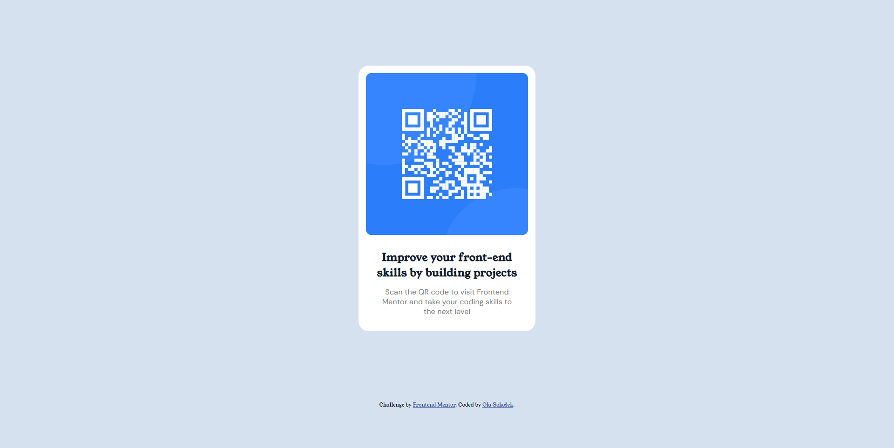

# Frontend Mentor - QR code component | Solution

This [QR code component challenge on Frontend Mentor](https://www.frontendmentor.io/challenges/qr-code-component-iux_sIO_H) is to build out this QR code component and get it looking as close to the design as possible. 

### What is Frontend Mentor?
[Frontend Mentor](https://www.frontendmentor.io/) challenges help me improve my skills in coding CSS by building realistic projects. 

## Table of contents

- [Frontend Mentor - QR code component | Solution](#frontend-mentor---qr-code-component--solution)
    - [What is Frontend Mentor?](#what-is-frontend-mentor)
  - [Overview](#overview)
    - [Screenshot of my solution](#screenshot-of-my-solution)
    - [Links](#links)
  - [My process](#my-process)
    - [Coding the card involved:](#coding-the-card-involved)
    - [Built with](#built-with)
    - [What I learned](#what-i-learned)
      - [Fitting the image within the card](#fitting-the-image-within-the-card)
        - [Solution](#solution)
      - [Box Model Considerations:](#box-model-considerations)
      - [Centering the card horizontally](#centering-the-card-horizontally)
      - [Distributing the card and attribution text vertically within a viewport](#distributing-the-card-and-attribution-text-vertically-within-a-viewport)
    - [Useful resources](#useful-resources)
  - [Author](#author)

## Overview

### Screenshot of my solution

\
*In the solution I decided to go for fonts that fit better to the design. Font 'Young Serif' was used for the heading and attribution, while 'Rethink Sans' was used for the paragraph.*

### Built with

- Semantic HTML5 markup
- Pure CSS
- Vercel (hosting & deployment)

- Git VCS

### 🟢 LIVE  Preview

- [css-practice-wine.vercel.app](https://css-practice-wine.vercel.app/)
- [css-practice-ola-sks-projects.vercel.app](https://css-practice-ola-sks-projects.vercel.app/)

### Links
- Solution URL: [github.com/ola-sk/CSS-practice](https://github.com/ola-sk/CSS-practice/tree/main/qr-code-component)
- [Solution's page on Frontend Mentor](https://www.frontendmentor.io/solutions/responsive-qr-code-component-semantics-html-pure-css-rTNj69JdMi)

## My process

In this solution I place the card within the wrapper container which serves to center the card vertically. The wrapper container itself takes most of the viewport's height and expands based on content (min-height). It needs to be a separate container because it is not feasible to set minimum height on the body element itself. Since it is a flexbox container I center the card within it bot horizontally and vertically, I also set the width of the card and set the margin left and margin right to auto (standard horizontal centering method). The attribution text gets centered by the `text-align: center` attribute, but it could also be a next item of the wrapper flexbox.

### Coding the card involved:
1. Establishing the extrinsic sizing for the width of the card itself and centering it horizontally. Card is centered within the viewport by using `margin: auto` on the right and left margins.
2. Deciding the layout structure to use within the card. I made:
   1. The image adjust its size to fit in the card (on the image: `max-width: 100%;` and height left default `auto` which keeps the image always adhere to its aspect ratio);
   2. Simply let the rest of the content take as much space below it as needed. I achieved that by not limiting the height of the card, which stayed the default `auto`.
3. Adding padding and margins and border-radius for card and image, adjusting those sizes to look well on different screen sizes: finding out what the sizes are relative to.
4. Distributing vertically the content: card and attribution text, on the page. I placed the card within a flexbox container to expand the flexbox container within the free whitespace in the viewport and center the card vertically within that container vertically. This comes in practical to push the attribution to the bottom of the viewport and center the card vertically on a long/big display, but is flexible at the same time letting the card's content to expand beyond the height of the viewport, keeping the content and its paddings and margins in tact when the viewport is short and letting the vertical page scroll. I did that to make sure both card and attribution are properly placed on larger screens and `min-height: 87vh` for the flexbox container makes sure that the container together with card can grow vertically in size when the screen is small and take as much height as needed to accomodate the card.
5. Choosing the font and right sizes.
6. Making use of semantic elements such as  `<header>`, `<main>`, and `<article>` and `<footer>` in HTML markup. Those are important for SEO, assistive technologies and developers, helping better understand the relationships between different sections of content.
7. Making the QR code image and header anchors/links. For accessibility reasons and just better experience I made the QR code clickable so that if the user is not able to scan the QR code, user can still access the target easily by tapping or clicking the image or the header.
8. Adapting the layout to different screen sizes: resulting layout in general adjusts well to various screen sizes, but I made padding within the card dynamic by using clamp along with dynamic sizing dependent on the width of the screen. I also increased the width of the card on the screen for small displays: I removed the padding within the card for screens smaller than 500px and increased card's relative dimentions to 100dvw for windows smaller than 300px which makes margin around the card almost non-existing at small display sizes. 
9. Hand-tuning parameters to make final product look well at different sizes.

### What I learned

Some of my major learnings while working through this project:

#### Fitting the image within the card
In CSS, each element's **height is typically determined independently based on its content (height: auto), unless explicitly specified**. The `height` property's default value is `auto` and in case of images it takes the size determined by both width and aspect ratio, if width is specified. However, there are situations where the height might be constrained due to the size of parent - that is when the overflow happens. When an image overflows its container, and the overflow property is set to visible (or not specified, as visible is the default value), the overflowing content will extend beyond the boundaries of the container. In this scenario, the containers defined after that one in HTML markup will appear right after the size constrained container and in front of the overflowing content. Depending on the positioning, content may behave differently.

##### Solution
I used `max-width: 100%;` in the CSS to set the width of the image relative to the direct parent `div` which is the card itself. The image behaved nicely and scaled after adding the padding to the card.
I skipped specifying height, as the default value for height is `auto`. The image with the setting `max-width: 100%;` without specifying a fixed height automatically maintains its original aspect ratio, adjusting the height proportionally based on its width.

#### Box Model Considerations:
When coding a CSS solution generally one needs to consider box-sizing to include or exclude **the size of any padding and border** when fitting the content - [see MDN article with an example illustrating box-sizing](https://developer.mozilla.org/en-US/docs/Web/CSS/box-sizing). 

#### Centering the card horizontally
This was easy as it is a single container that needs to be centered within a viewport. I used `margin: auto` on the card (left and right), after giving it specific width (the height stays automatic to accommodate all content). Independent of centering method, Flexbox or `margin: auto`, width should usually be specified.

#### Distributing the card and attribution text vertically within a viewport
To align items on the vertical axis there are two options: flexbox or grid. Absolute positioning would be inflexible approach, because it would only be able to translate the position of the card relative to the containing box (the viewport) without accounting for its own size. Flexbox can do what absolute positioning cannot and, for me, it centers the card within the minimum of 87% of the (small) viewport height placed at the top of the screen (that is what the flexbox container takes). Below the flex container the attribution takes its own space as much as it needs to be determined by its content size and padding. 

### Useful resources

- [Git Branch Management](https://git-scm.com/book/be/v2/Git-Branching-Branch-Management) - Usually useful when I need to rename the branch and reflect it on the remote or check if I merged branches.
- [Vercel](https://vercel.com/) - With Vercel you can deploy your project. Here is a [table of limits](https://vercel.com/docs/limits/overview#connecting-a-project-to-a-git-repository) on the platform.
- [Flexible Grids](https://css-tricks.com/books/greatest-css-tricks/flexible-grids/) Although the grid was not used here, I got excited about being able to create an extendable grid that grows and adjusts as new items are added to it.
- [MDN - Using media queries](https://developer.mozilla.org/en-US/docs/Web/CSS/CSS_media_queries/Using_media_queries)
- [MDN - Clamp](https://developer.mozilla.org/en-US/docs/Web/CSS/clamp)

## Author

- LinkedIn - [ola.sokolek](https://www.linkedin.com/in/olasokolek/)
- Website - [olasok.dev](https://olasok.dev)
- Frontend Mentor - [@ola-sk](https://www.frontendmentor.io/profile/ola-sk)
- Github - [@ola-sk](https://github.com/ola-sk)
